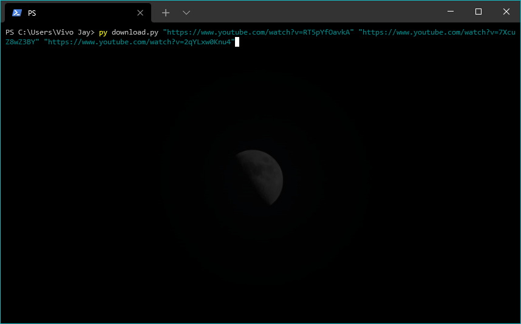

# Youtube-wav-downloader
## Who needs this?
#### This project is primarily intended for music producers to allow them to easily download audios from YouTube videos, but anyone and everyone can use it for their personal work.

## Why do you need this?
This is a simple *command line* tool that allows anyone to be able to download **audios-only** from YouTube videos.
I do understand that there are quite a few python libraries that allow you to download not only audios but videos also.
So for the sake of simplicity and ease of use, this program is dedicated to only download ready-to-use **audio-only .wav** files.

## Requirements
**This program has been tested on Windows OS only and will assume that you have Windows from here on.**
- This requires you to [download ffmpeg](https://www.gyan.dev/ffmpeg/builds/) from GyanDev *(for Windows Only)*. The **ffmpeg essentials release** will suffice.
- 

## Features
Search and/or Download Youtube Videos in wav format

## Usage Instructions
1. Open powershell. Use the shortcut `⊞ Win` +`R`, type `powershell` in the dialog box and hit enter.

2. When powershell opens up, type the path to the folder where the the files are downloaded.
**E.g.** If you have downloaded the files in the folder **youtube_downloader** in the folder 
**C:\Users\Vivo Jay\Downloads** you will need to do the following:
Type `cd "C:\Users\Vivo Jay\Downloads"` and hit enter.\
\
**Now you are ready to actually run the program**

3. Just to check if installations have been successful, type `py download.py` and hit enter, if it shows `Error: No parameters entered, exiting...`, then it means **the program is working fine**.
4. Now to actually download the audio from the YouTube video, there are **two methods.**
- **Method 1:** Enter one or multiple URLs in double quotes separated by a space after `py download.py`. For example if you want to download audios from the following URLs:
	- https://www.youtube.com/watch?v=RT5pYfOavkA
	- https://www.youtube.com/watch?v=7XcuZ8wZ3BY
	- https://www.youtube.com/watch?v=2qYLxw0Knu4

&nbsp;&nbsp;&nbsp;&nbsp;&nbsp;&nbsp;&nbsp;&nbsp;&nbsp;The final command looks like this:\
&nbsp;&nbsp;&nbsp;&nbsp;&nbsp;&nbsp;&nbsp;&nbsp;&nbsp;`py download.py "https://www.youtube.com/watch?v=RT5pYfOavkA" "https://www.youtube.com/watch?v=7XcuZ8wZ3BY" "https://www.youtube.com/watch?v=2qYLxw0Knu4"`

&nbsp;&nbsp;&nbsp;&nbsp;&nbsp;&nbsp;&nbsp;&nbsp;&nbsp;If you want to download a single URL just type that in the double quotes instead as follows:
`py download.py "https://www.youtube.com/watch?v=RT5pYfOavkA"`

**In powershell it looks like this**

- **Method 2:** If you want to searhc for a video and then download it, just type `py download.py s` followed by the search terms (w/o double quotes this time)
**E.g.** If you want to search for "lolo zouai moi lyric video" then type the following command:
`py download.py s lolo zouai moi lyric video`

**In powershell it looks like this**

