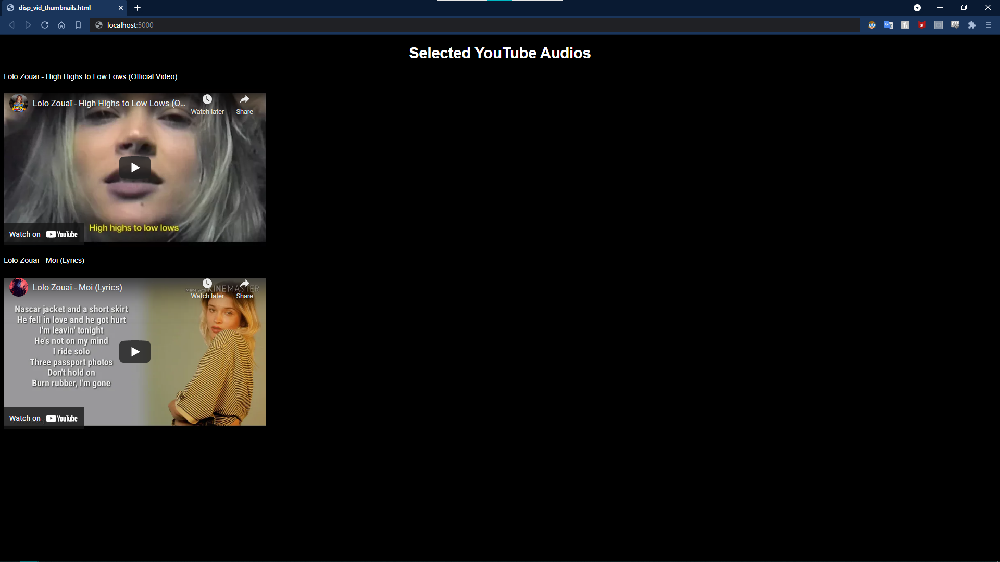

# YouTube-wav-Downloader

## Who needs this?

#### This project is primarily intended for music producers to allow them to easily download audios from YouTube videos, but anyone and everyone can use it for their personal work too.

## Why would you need this?

This is a simple *command line* tool that allows anyone to be able to download **audios-only** from YouTube videos.
#### I do understand that there are quite a few python libraries that allow you to download not only audios but videos also.
So for the sake of simplicity and ease of use, this program is dedicated to only download and/or search for YouTube videos for ready-to-use **audio-only .wav** files with user-experience in mind.

## Requirements

**This program has been tested on Windows OS only and will assume that you have Windows from here on.**

This program **may require** that you [download the 7zip archiving program](https://www.7-zip.org/) (This requirement **depends on availability** of .zip or .7z ffmpeg downloads - see next steps).

- This requires you to first [download ffmpeg from GyanDev](https://www.gyan.dev/ffmpeg/builds/) *(for Windows Only)*. The **ffmpeg essentials release** will suffice.

  

  For detailed instructions on how to properly download ffmpeg watch this excellent video by TroubleChute on YouTube.

- If the ffmpeg essentials download only has a **.7z** version and not a .zip, you will need to download the [**7zip** archiver](https://www.7-zip.org/) (zip/unzip tool).
  

- If you haven't already, you will need to install [**python**](https://www.python.org/), preferably the [latest version](https://www.python.org/downloads/). You can also [download python 3.9.5 (Latest version at the time of writing)](https://www.python.org/ftp/python/3.9.5/python-3.9.5-amd64.exe).

  **Note that Python 3.9+ *cannot* be used on Windows 7 or earlier.**
  **\*\*** If you are on **Windows 7 or earlier** you can still [**download python 3.8.10**](https://www.python.org/ftp/python/3.8.10/python-3.8.10-amd64.exe) or *anything above 3.6* and expect full functionality.

  ### Note: On Installation, make sure to enable the `Add python to path` option for whatever version you are installing.

  

- After this, you need to install some *"python packages"*.
  This is very easy, you just need to enter `pip install -r requirements.txt` in **cmd**.
  **cmd** or **command prompt** is a preinstalled application on Windows OS systems.

  **To open cmd**, use the shortcut `⊞ Win` +`R`, type `cmd` in the dialog box and hit enter.
  
   

#### When opened, cmd looks like this

- **Note: After running the** `pip install -r requirements.txt` **you'll be greeted with a looong installation, don't mind, keep waiting and continue once done!**

## Features
1. You can download audio from **any** YouTube URL you want.
2. You can download audios from **multiple** YouTube video URLs at once.
3. You can use the simple built in **text-based YouTube search** to search and download videos you like.
4. Any **duplicate files** will automatically be detected and will NOT be downloaded.
5. *New:* You can now download all songs from **Playlists on YouTube Music**
6. *New:* You can now download YouTube audios by adding urls to **separate "urls.txt" file** instead of writing typing out each one [Explained Later]
7. *New:* You can now download songs from Spotify (**\*accuracy may be less**) [NEEDS SPOTIFY API CREDENTIALS!] [Learn more](#method-5-of-5-download-songs-from-spotify-playlists)
8. After confirming downloads, you will be shown the selected downloaded videos **in your browser**.

**Note: Downloaded videos are always converted to `.wav` format**

## Usage Instructions
1. **Make sure all requirements are satisfied before starting with this program.**
2. When cmd opens up, type the path to the folder where this project's files are downloaded.
   **E.g.** If you have downloaded the files in the folder **youtube_downloader** in the location 
   **C:\Users\Vivo Jay\Downloads** you will need to do the following:
   Type `cd "C:\Users\Vivo Jay\Downloads"` and hit enter (Double quotes are required).
   

3. Type `pip` and then `py --version` and check if they work\
   \
   
  
   We DON'T want this (If this happens, you must **REINSTALL PYTHON [See in "Requirements"]**):\
   

4. Now, type `pip install -r -requirements.txt` [See from Heading "Requirements"]
   **You don't need to do this again if you have done it once.**
   

5. Just to check if installations have been successful, type `py download.py` and hit enter, if it shows `Error: No parameters entered, exiting...`, then it means **the program is working fine**.
   

6. **Now you are ready to actually run the program**. To start downloading audio, there are **five methods.** Choose from below

## Choose your download method:
- [Download from URLs](#method-1-of-5-download-from-url)
- [Search and Download](#method-2-of-5-search-and-download)
- [Download using text file](#method-3-of-5-download-urls-from-text-file)
- [Download Playlists from YouTube Music](#method-4-of-5-download-playlists-from-youtube-music)
- *New* [Download songs from Spotify Playlists](#method-5-of-5-download-songs-from-spotify-playlists)
\
&nbsp;
## Method 1 of 5 [Download from URL]:
#### Enter one or multiple URLs in double quotes separated by a space after `py download.py`. For example if you want to download audios from the following URLs:
  - https://www.youtube.com/watch?v=RT5pYfOavkA
  - https://www.youtube.com/watch?v=7XcuZ8wZ3BY
  - https://www.youtube.com/watch?v=2qYLxw0Knu4

&nbsp;&nbsp;&nbsp;&nbsp;&nbsp;&nbsp;&nbsp;&nbsp;&nbsp;The final command looks like this:\
&nbsp;&nbsp;&nbsp;&nbsp;&nbsp;&nbsp;&nbsp;&nbsp;&nbsp;`py download.py "https://www.youtube.com/watch?v=RT5pYfOavkA" "https://www.youtube.com/watch?v=7XcuZ8wZ3BY" "https://www.youtube.com/watch?v=2qYLxw0Knu4"`

&nbsp;&nbsp;&nbsp;&nbsp;&nbsp;&nbsp;&nbsp;&nbsp;&nbsp;If you want to download a single URL just type that in the double quotes instead as follows:
`py download.py "https://www.youtube.com/watch?v=RT5pYfOavkA"`

Then it asks you where you want to save the file.
Here, you can either:

- Enter/paste the path you want OR
- Don't type anything and just hit enter to **automatically** download in the **default Downloads** folder

### **Here's a detailed guide on how to download audios**

#### Add single URL or multiple URLs separated by spaces

#### Next it prompts you to enter a path to save to

#### You can enter a path manually or copy-paste

#### Selected videos will be displayed in a table like this

### After you confirm, your downloads will start shortly

**Now the downloaded files are converted to wav files for easy use in your [DAW](https://en.wikipedia.org/wiki/Digital_audio_workstation)**

### After confirming downloads, the selected audios will open in your browser

#### You may also enter a save location before entering URLs at the start (optional)

#### This program detects duplicate downloaded files also

#### It always asks you for confirmation before downloads and you can cancel downloads if you wish

## Method 2 of 5 [Search and Download]:
#### If you want to search for a video and then download it, just type `py download.py s` followed by the search terms (without double quotes this time).
  **E.g.** If you want to search for "lolo zouai moi lyric video" then type the following command:
  `py download.py s lolo zouai moi lyric video`

**In cmd it looks like this**

#### Here you have the option to select one or more search results
- **To select a video just type the number given next to it**
- **To select a multiple videos type the video numbers separated by spaces**

#### Just like before, enter the path you would like to save the audio(s) to

#### Note that if you leave the save location empty, it will automatically save to the Default Download Path

#### The selected audios will be displayed in a table

#### As always, the selected audios will open in your browser once you confirm your downloads

### You will now be able to see the downloaded audios where you saved them

## Method 3 of 5 [Download URLs from text file]:
### This provides you an **easier** way to enter URLs.
  How does it work?
  Instead of entering URLs in the terminal directly, you can now add them in a text file in *separate lines* and save it in **"urls.txt"**.
  
  **Important Note:**
  **Make sure to create this file in this project's folder**
  So if you have downloaded the project as **C:\Users\VivoJay\Downloads\YouTube-wav-Downloader** then you need to create the file in that SAME folder.
  \
  \
  \
  **This This is an example of how the file "urls.txt" may look like:**

  

  Now to download audios from this file, just type `py download.py urls`.
  
#### This is all you need to type
  

#### Choose a download path and continue as usual
  

## Method 4 of 5 [Download Playlists from YouTube Music]:
#### To download YouTube Music playlists, all you need to do is add their links to a txt file named **"yt_playlists.txt"** in **this project's folder**.
  So if you have downloaded the project as **C:\Users\VivoJay\Downloads\YouTube-wav-Downloader** then you need to create the file in that SAME folder.
  Now in this file, add the YouTube Music Playlist URLs in *separate lines*.
  \
  \
  **This is an example of how the file "yt_playlists.txt" may look like:**
  
  

#### This is all you need to type in cmd
  
  **Note:** This can take some time!

#### After this you can continue downloading as usual
  
#### The Playlists will be loaded and you'll their name and author
  

## Method 5 of 5 [Download songs from Spotify Playlists]:

### This requires you to register on developers.spotify.com as a developer and get your "SPOTIFY API KEY"
If you are NOT familiar with this, you can leave this method. This method delves into a bit more advanced stuff than the rest of this program.

Anyways, if you want a quick start, view this small and quick ["BASIC TUTORIAL"](#extras---spotify-developers-tutorial) and come back here once you're done.

### Simple guide on **How to find spotify playlist URIs** given later. . .
### This method is similar to Method 4:
#### To download spotify playlists, all you need to do is add their links to a txt file named **"spot_playlists.txt"** in **this project's folder**.
  So if you have downloaded the project as **C:\Users\VivoJay\Downloads\YouTube-wav-Downloader** then you need to create the file in that SAME folder.
  Now in this file, add the YouTube Music Playlist URLs in *separate lines*.
  \
  \
  **This is an example of how the file "spot_playlists.txt" may look like:**
  
  #### The playlists tracks will now be loaded one-by-one
  
  Now to download audios from this file, just type `py download.py spot` and the songs from your selected Spotify Playlist will start loading.
  
  **Note:** This can take some time!
  

  Download where you wish
  
  **Now continue normally, the program will guide you**

### Right click on the playlist, go to `Share`, select `Copy link to Playlist`

## Extras - Spotify Developers Tutorial
1. Visit the [Spotify Dashboard](https://developer.spotify.com/dashboard/login) and sign up.
   
2. Accept their terms
   
3. Click "Create an App"
   
4. Name it whatever you want (E.g. "Cool App"), tick the checkboxes, add any description and hit "create"
   
5. NEVER share your "Client ID" or "Client Secret" with anyone (Not even yourself \s)
   
6. Use the `SET` command in cmd as follows:
   If your Client ID is `99999999999999999999aaaaaaaaaaaa` and
   your Client Secret is `11111111111111111111bbbbbbbbbbbb`, then:
   
   Open the commands prompt and type the following commands [Replace these with your own ID and Secret]:
   - `SET SPOT_CLIENT_ID=99999999999999999999aaaaaaaaaaaa`
   - `SET SPOT_CLIENT_SECRET=11111111111111111111bbbbbbbbbbbb`
   
   After this, you are set to start downloading your own Spotify Playlist Tracks, [go here](#method-5-of-5-download-songs-from-spotify-playlists)
