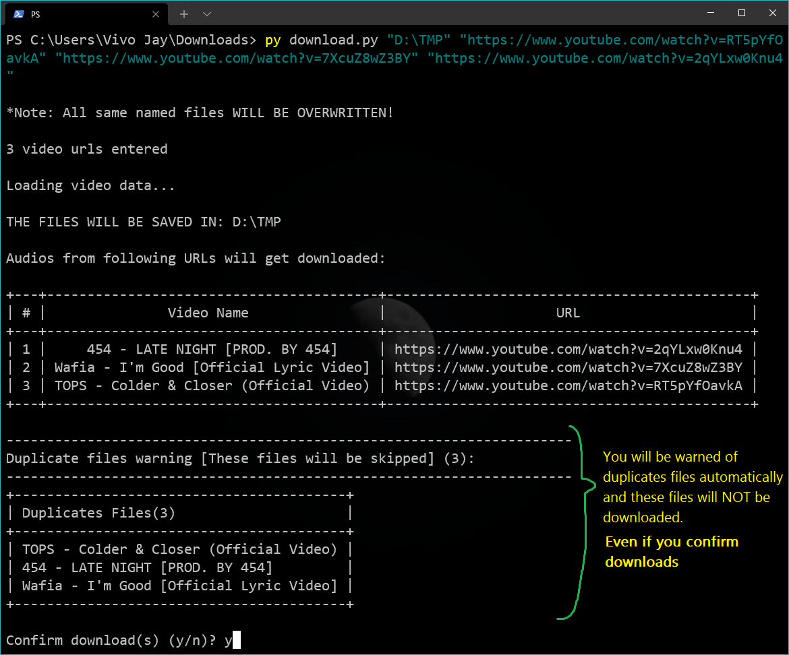
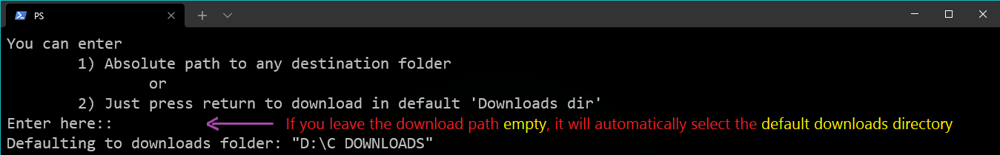

# YouTube-wav-downloader

## Who needs this?

#### This project is primarily intended for music producers to allow them to easily download audios from YouTube videos, but anyone and everyone can use it for their personal work too.

## Why would you need this?

This is a simple *command line* tool that allows anyone to be able to download **audios-only** from YouTube videos.
#### I do understand that there are quite a few python libraries that allow you to download not only audios but videos also.
So for the sake of simplicity and ease of use, this program is dedicated to only download and/or search for YouTube videos for ready-to-use **audio-only .wav** files with user-experience in mind.

## Requirements

**This program has been tested on Windows OS only and will assume that you have Windows from here on.**

This program **may require** that you [download the 7zip archiving program](https://www.7-zip.org/) (This requirement **depends on availability** of .zip or .7z ffmpeg downloads - see next steps).

- This requires you to first [download ffmpeg from GyanDev](https://www.gyan.dev/ffmpeg/builds/) *(for Windows Only)*. The **ffmpeg essentials release** will suffice. For detailed instructions on how to properly download ffmpeg [watch this video by TroubleChute](https://www.youtube.com/watch?v=r1AtmY-RMyQ).

- If the ffmpeg essentials download only has a **.7z** version and not a .zip, you will need to download the [**7zip** archiver](https://www.7-zip.org/) (zip/unzip tool).

- If you haven't already, you will need to install [**python**](https://www.python.org/), preferably the [latest version](https://www.python.org/downloads/). You can also [download python 3.9.5 (Latest version at the time of writing)](https://www.python.org/ftp/python/3.9.5/python-3.9.5-amd64.exe).

  **Note that Python 3.9+ *cannot* be used on Windows 7 or earlier.**
  **\*\*** If you are on **Windows 7 or earlier** you can still [**download python 3.8.10**](https://www.python.org/ftp/python/3.8.10/python-3.8.10-amd64.exe) or *anything above 3.6* and expect full functionality.

  ### Note: On Installation, make sure to enable the `Add python to path` option for whatever version you are installing.

  

- After this, you need to install some *"python packages"*.
  This is very easy, you just need to enter `pip install -r requirements.txt` in **cmd**.
  ### Note to reader: Be aware that the requirements.txt has not been uploaded yet
  **cmd** or **command prompt** is a preinstalled application on Windows OS systems.

  **To open cmd**, use the shortcut `⊞ Win` +`R`, type `cmd` in the dialog box and hit enter.
  
   

#### When opened, cmd looks like this

## Features
1. You can download audio from **any** YouTube URL you want.
2. You can download audios from **multiple** YouTube video URLs at once.
3. You can use the simple built in **text-based YouTube search** to search and download videos you like.
4. After confirming downloads, you will be shown the selected downloaded videos **in your browser**.
**Note: Downloaded videos are always converted to `.wav` format**

## Usage Instructions
1. **Make sure all requirements are satisfied before starting with the usage.**
2. When cmd opens up, type the path to the folder where the the files are downloaded.
   **E.g.** If you have downloaded the files in the folder **youtube_downloader** in the folder 
   **C:\Users\Vivo Jay\Downloads** you will need to do the following:
   Type `cd "C:\Users\Vivo Jay\Downloads"` and hit enter.

   **Now you are ready to actually run the program**

3. Just to check if installations have been successful, type `py download.py` and hit enter, if it shows `Error: No parameters entered, exiting...`, then it means **the program is working fine**.
4. Now to actually download the audio from the YouTube video, there are **two methods.**

- **Method 1 [Download from URL]:** Enter one or multiple URLs in double quotes separated by a space after `py download.py`. For example if you want to download audios from the following URLs:
  - https://www.youtube.com/watch?v=RT5pYfOavkA
  - https://www.youtube.com/watch?v=7XcuZ8wZ3BY
  - https://www.youtube.com/watch?v=2qYLxw0Knu4

&nbsp;&nbsp;&nbsp;&nbsp;&nbsp;&nbsp;&nbsp;&nbsp;&nbsp;The final command looks like this:\
&nbsp;&nbsp;&nbsp;&nbsp;&nbsp;&nbsp;&nbsp;&nbsp;&nbsp;`py download.py "https://www.youtube.com/watch?v=RT5pYfOavkA" "https://www.youtube.com/watch?v=7XcuZ8wZ3BY" "https://www.youtube.com/watch?v=2qYLxw0Knu4"`

&nbsp;&nbsp;&nbsp;&nbsp;&nbsp;&nbsp;&nbsp;&nbsp;&nbsp;If you want to download a single URL just type that in the double quotes instead as follows:
`py download.py "https://www.youtube.com/watch?v=RT5pYfOavkA"`

Then it asks you where you want to save the file.
Here, you can either:

- Enter/paste the path you want OR
- Don't type anything and just hit enter to **automatically** download in the **default Downloads** directory

### **Here's a detailed guide on how to download audios**

#### Add single URL or multiple URLs separated by spaces

#### Next it prompts you to enter a path to save to

#### You can enter a path manually or copy-paste

#### Selected videos will be displayed in a table like this

### After you confirm, your downloads will start shortly

**Now the downloaded files are converted to wav files for easy use in your [DAW](https://en.wikipedia.org/wiki/Digital_audio_workstation)**

### After confirming downloads, the selected audios will open in your browser

#### You may also enter a save location before entering URLs at the start (optional)

#### This program detects duplicate downloaded files also

#### It always asks you for confirmation before downloads and you can cancel downloads if you wish

- **Method 2 [Search and Download]:** If you want to search for a video and then download it, just type `py download.py s` followed by the search terms (without double quotes this time).
  **E.g.** If you want to search for "lolo zouai moi lyric video" then type the following command:
  `py download.py s lolo zouai moi lyric video`

**In cmd it looks like this**

#### Here you have the option to select one or more search results
- **To select a video just type the number given next to it**
- **To select a multiple videos type the video numbers separated by spaces**

#### Just like before, enter the path you would like to save the audio(s) to

#### The selected audios will be displayed in a table

#### As always, the selected audios will open in your browser once you confirm your downloads

